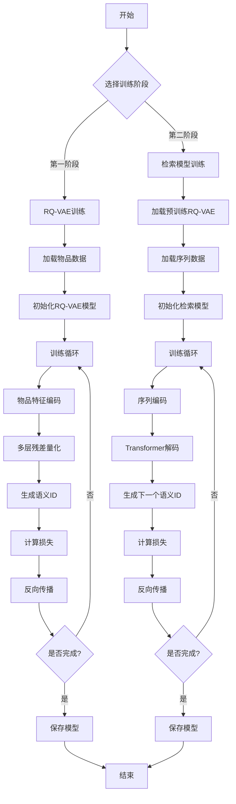
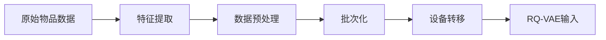
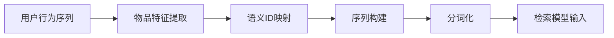

# RQ-VAE 推荐系统代码流程图

## 🔄 完整系统流程图



## 📊 详细代码执行流程

### 第一阶段：RQ-VAE训练 (`train_rqvae.py`)

#### 1. 初始化阶段
```python
# 1. 配置解析
@gin.configurable
def train(iterations=50000, batch_size=64, ...):
    # 解析gin配置文件参数
    
# 2. 加速器初始化
accelerator = Accelerator(
    split_batches=split_batches,
    mixed_precision=mixed_precision_type if amp else 'no'
)

# 3. 数据集加载
train_dataset = ItemData(
    root=dataset_folder, 
    dataset=dataset, 
    force_process=force_dataset_process, 
    train_test_split="train" if do_eval else "all", 
    split=dataset_split
)

# 4. 数据加载器
train_dataloader = DataLoader(
    train_dataset, 
    sampler=train_sampler, 
    batch_size=None, 
    collate_fn=lambda batch: batch
)
```

#### 2. 模型初始化
```python
# 5. RQ-VAE模型创建
model = RqVae(
    input_dim=vae_input_dim,        # 768
    embed_dim=vae_embed_dim,        # 32
    hidden_dims=vae_hidden_dims,    # [512, 256, 128]
    codebook_size=vae_codebook_size, # 256
    codebook_kmeans_init=use_kmeans_init,
    codebook_normalize=vae_codebook_normalize,
    codebook_mode=vae_codebook_mode,
    n_layers=vae_n_layers,          # 3
    commitment_weight=commitment_weight # 0.25
)

# 6. 优化器
optimizer = AdamW(
    params=model.parameters(),
    lr=learning_rate,
    weight_decay=weight_decay
)
```

#### 3. 训练循环
```python
# 7. 主训练循环
for iteration in tqdm(range(iterations)):
    # 获取批次数据
    batch = next_batch(train_dataloader)
    batch = batch_to(batch, device)
    
    # 前向传播
    with accelerator.autocast():
        losses = model(batch, gumbel_t=gumbel_t)
        loss = losses.loss
    
    # 反向传播
    accelerator.backward(loss)
    optimizer.step()
    optimizer.zero_grad()
    
    # 日志记录
    if iteration % log_every == 0:
        log_metrics(losses, iteration)
    
    # 模型保存
    if iteration % save_model_every == 0:
        save_checkpoint(model, optimizer, iteration)
```

### 第二阶段：检索模型训练 (`train_decoder.py`)

#### 1. 初始化阶段
```python
# 1. 加载预训练RQ-VAE
if pretrained_rqvae_path:
    rqvae = RqVae.load_pretrained(pretrained_rqvae_path)
    rqvae.eval()

# 2. 创建语义ID分词器
tokenizer = SemanticIdTokenizer(
    rqvae=rqvae,
    device=device
)

# 3. 加载序列数据
train_dataset = SeqData(
    root=dataset_folder, 
    dataset=dataset, 
    is_train=True, 
    subsample=train_data_subsample, 
    split=dataset_split
)
```

#### 2. 模型初始化
```python
# 4. 检索模型创建
model = EncoderDecoderRetrievalModel(
    embedding_dim=decoder_embed_dim,    # 128
    attn_dim=attn_embed_dim,           # 512
    dropout=dropout_p,                  # 0.3
    num_heads=attn_heads,              # 8
    n_layers=attn_layers,              # 8
    num_embeddings=vae_codebook_size,  # 256
    sem_id_dim=vae_n_layers,           # 3
    inference_verifier_fn=tokenizer.verify_semantic_ids
)
```

#### 3. 训练循环
```python
# 5. 主训练循环
for iteration in tqdm(range(iterations)):
    # 获取批次数据
    batch = next_batch(train_dataloader)
    batch = batch_to(batch, device)
    
    # 序列分词化
    tokenized_batch = tokenizer.tokenize_sequences(batch)
    
    # 前向传播
    with accelerator.autocast():
        model_output = model(tokenized_batch)
        loss = model_output.loss
    
    # 反向传播
    accelerator.backward(loss)
    optimizer.step()
    optimizer.zero_grad()
    
    # 评估
    if iteration % full_eval_every == 0:
        evaluate_model(model, tokenizer, eval_dataloader)
```

## 🔧 核心模块详细流程

### RQ-VAE模块 (`modules/rqvae.py`)

#### 前向传播流程
```python
def forward(self, batch: SeqBatch, gumbel_t: float) -> RqVaeComputedLosses:
    # 1. 编码器处理
    x = batch.x  # [batch_size, input_dim]
    encoded = self.encoder(x)  # [batch_size, embed_dim]
    
    # 2. 多层残差量化
    embeddings = []
    residuals = []
    sem_ids = []
    quantize_loss = 0
    
    current_input = encoded
    for i, layer in enumerate(self.layers):
        # 量化当前层
        quantized, loss = layer(current_input, gumbel_t)
        embeddings.append(quantized)
        residuals.append(current_input - quantized)
        
        # 获取语义ID
        sem_id = layer.get_codebook_indices(current_input)
        sem_ids.append(sem_id)
        
        quantize_loss += loss
        
        # 准备下一层输入
        if i < len(self.layers) - 1:
            current_input = residuals[-1]
    
    # 3. 解码器重构
    reconstructed = self.decoder(embeddings[-1])
    
    # 4. 计算损失
    reconstruction_loss = self.reconstruction_loss(reconstructed, x)
    total_loss = reconstruction_loss + quantize_loss
    
    return RqVaeComputedLosses(
        loss=total_loss,
        reconstruction_loss=reconstruction_loss,
        rqvae_loss=quantize_loss,
        embs_norm=embeddings[-1].norm(dim=-1).mean(),
        p_unique_ids=self._compute_unique_ids_ratio(sem_ids)
    )
```

### 检索模型模块 (`modules/model.py`)

#### 前向传播流程
```python
def forward(self, batch: TokenizedSeqBatch) -> ModelOutput:
    # 1. 嵌入层处理
    sem_id_embeddings = self.sem_id_embedder(batch.sem_ids)
    user_embeddings = self.user_id_embedder(batch.user_ids)
    
    # 2. 位置编码
    position_embeddings = self.wpe(batch.positions)
    
    # 3. 输入投影
    input_embeddings = sem_id_embeddings + user_embeddings + position_embeddings
    projected_input = self.in_proj(input_embeddings)
    
    # 4. Transformer编码-解码
    if self.jagged_mode:
        # 使用自定义Transformer
        encoded = self.transformer.encode(projected_input)
        decoded = self.transformer.decode(encoded, projected_input)
    else:
        # 使用标准Transformer
        encoded = self.transformer.encoder(projected_input)
        decoded = self.transformer.decoder(projected_input, encoded)
    
    # 5. 输出投影
    logits = self.out_proj(decoded)
    
    # 6. 计算损失
    loss = F.cross_entropy(
        logits.view(-1, logits.size(-1)), 
        batch.target_sem_ids.view(-1)
    )
    
    return ModelOutput(
        loss=loss,
        logits=logits,
        loss_d=loss.detach()
    )
```

## 📈 数据流转图

### 物品数据处理流程


### 序列数据处理流程


## 🎯 关键函数调用链

### RQ-VAE训练调用链
```
train_rqvae.py:train()
├── ItemData.__init__()
├── RqVae.__init__()
├── train_loop:
│   ├── next_batch()
│   ├── RqVae.forward()
│   │   ├── MLP.forward() (编码器)
│   │   ├── Quantize.forward() (多层量化)
│   │   ├── MLP.forward() (解码器)
│   │   └── loss计算
│   ├── backward()
│   └── optimizer.step()
└── save_checkpoint()
```

### 检索模型训练调用链
```
train_decoder.py:train()
├── RqVae.load_pretrained()
├── SemanticIdTokenizer.__init__()
├── EncoderDecoderRetrievalModel.__init__()
├── train_loop:
│   ├── next_batch()
│   ├── SemanticIdTokenizer.tokenize_sequences()
│   ├── EncoderDecoderRetrievalModel.forward()
│   │   ├── SemIdEmbedder.forward()
│   │   ├── UserIdEmbedder.forward()
│   │   ├── Transformer.forward()
│   │   └── loss计算
│   ├── backward()
│   └── optimizer.step()
└── save_checkpoint()
```

## 🔍 调试和监控点

### 1. 数据检查点
- 物品特征维度: `[batch_size, 768]`
- 语义ID维度: `[batch_size, 3]`
- 序列长度: 最大20 (Amazon) 或 200 (MovieLens)

### 2. 模型检查点
- RQ-VAE重构损失: 应该逐渐下降
- 量化损失: 应该保持稳定
- 检索模型损失: 应该逐渐下降

### 3. 性能监控
- GPU内存使用
- 训练速度 (iterations/second)
- 评估指标 (Top-K准确率)

---

*这个流程图详细展示了RQ-VAE推荐系统的完整代码执行过程，帮助你理解每个模块的作用和数据流转。* 